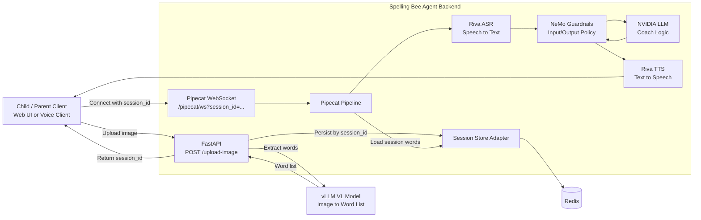

# spelling-bee-assistant

Spelling Bee backend with Pipecat voice pipeline (pattern adapted from `voice-agent-examples`).

This app uses a Pipecat-native quiz session with a lightweight upload bootstrap:
1. Upload image to extract spelling words and receive a `session_id`
2. Connect to Pipecat websocket with `session_id` and run voice quiz

## Clean Architecture Diagram



## Deployment Diagram

```mermaid
flowchart TB
		subgraph C[controller node]
			UI[spellingbee-ui\nNodePort 30080]
			GW[spellingbee-gateway\nClusterIP 8080]
			BE[spelling-bee-agent-backend\nNodePort 30088]
			REDIS[redis\nClusterIP 6379]
		end

		subgraph S1[spark-01 GPU node]
			VL1[vllm-nemotron-nano-vl-8b\nNodePort 30566]
			TXT1[vllm-llama-31-8b\nClusterIP 8000]
		end

		subgraph S2[spark-02 GPU node]
			VL2[(optional replica)]
			TXT2[(optional replica)]
		end

		USER[Browser / Voice Client]

		USER -->|HTTP| UI
		USER -->|HTTP/WS| BE
		BE -->|session memory| REDIS
		BE -->|VL inference| VL1
		BE -->|LLM text inference| TXT1
		GW -->|internal API calls (optional)| BE

		VL1 -. scale out .-> VL2
		TXT1 -. scale out .-> TXT2
```

## Run

Python requirement: `3.12+` (required by NVIDIA Pipecat).

Install dependencies:

```bash
pip install -r requirements.txt
```

Note: Pipecat is installed from NVIDIA source (`voice-agent-examples`) in `requirements.txt`.

Start backend:

```bash
python spelling_bee_agent_backend.py
```

Server runs on `http://0.0.0.0:8080`.

## Deploy to microk8s

This repo includes a backend container file at `Dockerfile`.

Build and push your backend image to local registry (example):

```bash
docker build -t localhost:32000/spelling-bee-agent-backend:0.1 .
docker push localhost:32000/spelling-bee-agent-backend:0.1
```

Create secret and deploy:

```bash
kubectl -n spellingbee create secret generic nvidia-api-key --from-literal=api-key=<YOUR_KEY>
kubectl apply -f spelling-bee-agent-backend.k8s.yaml
```

Check rollout:

```bash
kubectl get pods -n spellingbee -o wide
kubectl get svc -n spellingbee spelling-bee-agent-backend
```

If pods show `ImagePullBackOff`, rebuild and restart deployment:

```bash
docker build -t localhost:32000/spelling-bee-agent-backend:0.1 .
docker push localhost:32000/spelling-bee-agent-backend:0.1
kubectl -n spellingbee rollout restart deploy/spelling-bee-agent-backend
kubectl -n spellingbee get pods -w
```

## Required Environment Variables

Set NVIDIA/Riva variables such as `NVIDIA_API_KEY`, `RIVA_ASR_URL`, `RIVA_TTS_URL`.

For NeMo Guardrails:
- `ENABLE_NEMO_GUARDRAILS=true`
- `NEMO_GUARDRAILS_CONFIG_PATH=./guardrails`

## API Endpoints

- `POST /upload-image` → upload image and get `session_id`
- `WS /pipecat/ws` → Pipecat ACE websocket route (available when Pipecat deps are installed)

## Notes

- Quiz words are injected into Pipecat context from uploaded session data.
- Connect using: `/pipecat/ws?session_id=<session_id>`
- Guardrails policy files are in `guardrails/config.yml` and `guardrails/rails.co`.